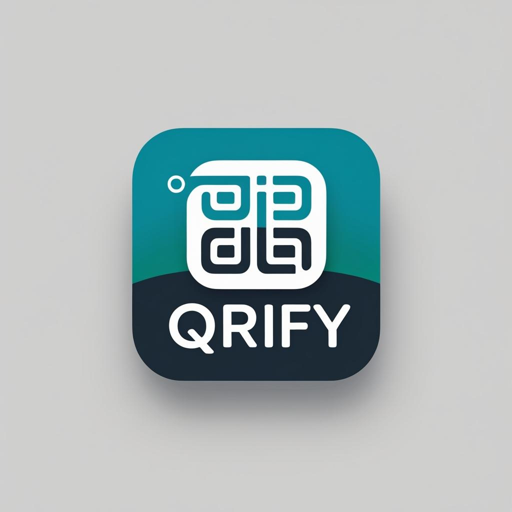

# QRify - Modern QR Code Generator

<div align="center">
  
  <h3>Create, Share, Connect Instantly!</h3>
  <p>Transform any link into a sleek QR code in seconds.</p>
</div>

## 🌟 Features

- **Instant QR Code Generation**: Generate QR codes from URLs with real-time preview
- **Modern UI/UX**: Beautiful, animated interface with blur effects and gradients
- **Save & Share**: Download QR codes to your device or share them directly
- **Responsive Design**: Works seamlessly on both phones and tablets
- **Error Handling**: Robust error management with user-friendly messages
- **Smooth Animations**: Elegant transitions and loading states

## 🚀 Tech Stack

- **Framework**: [React Native](https://reactnative.dev/) + [Expo](https://expo.dev/)
- **Navigation**: [Expo Router](https://docs.expo.dev/routing/introduction/)
- **UI Components**:
  - [React Native Reanimated](https://docs.swmansion.com/react-native-reanimated/) for animations
  - [Expo LinearGradient](https://docs.expo.dev/versions/latest/sdk/linear-gradient/) for gradient effects
  - [Expo BlurView](https://docs.expo.dev/versions/latest/sdk/blur-view/) for frosted glass effects
- **QR Code Generation**: [react-native-qrcode-svg](https://github.com/awesomejerry/react-native-qrcode-svg)
- **File System**: [Expo FileSystem](https://docs.expo.dev/versions/latest/sdk/filesystem/)
- **Media Management**:
  - [Expo MediaLibrary](https://docs.expo.dev/versions/latest/sdk/media-library/)
  - [Expo Sharing](https://docs.expo.dev/versions/latest/sdk/sharing/)

## 📱 Screenshots

[Add your app screenshots here]

## 🛠️ Installation

1. Clone the repository:

```bash
git clone ...
```

2. Install dependencies:

```bash
npm install
```

3. Start the development server:

```bash
npx expo start
```

## 📱 Running the App

- **iOS Simulator**:

```bash
npm run ios
```

- **Android Emulator**:

```bash
npm run android
```

- **Web Browser**:

```bash
npm run web
```

## 🏗️ Build

The app uses EAS Build for creating production builds:

- **Preview Build**:

```bash
eas build --profile preview
```

- **Production Build**:

```bash
eas build --profile production
```

## 🔑 Environment Setup

Ensure you have the following tools installed:

- Node.js (LTS version)
- npm or yarn
- Expo CLI (`npm install -g expo-cli`)
- iOS Simulator (macOS only) or Android Studio (for Android emulator)

## 👨‍💻 Author

Muhammad Rafiq

---

<div align="center">
  Made with ❤️ using React Native + Expo
</div>
